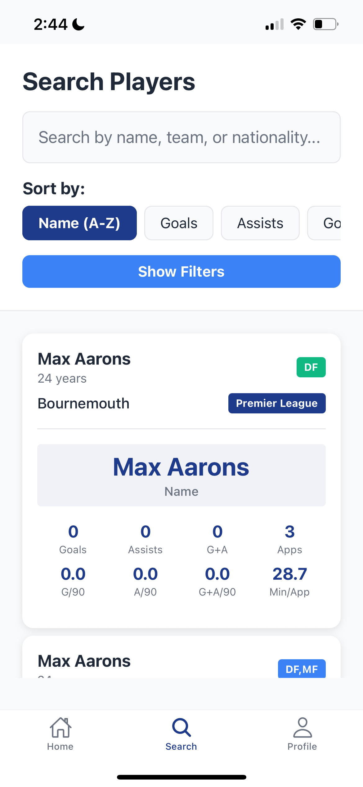
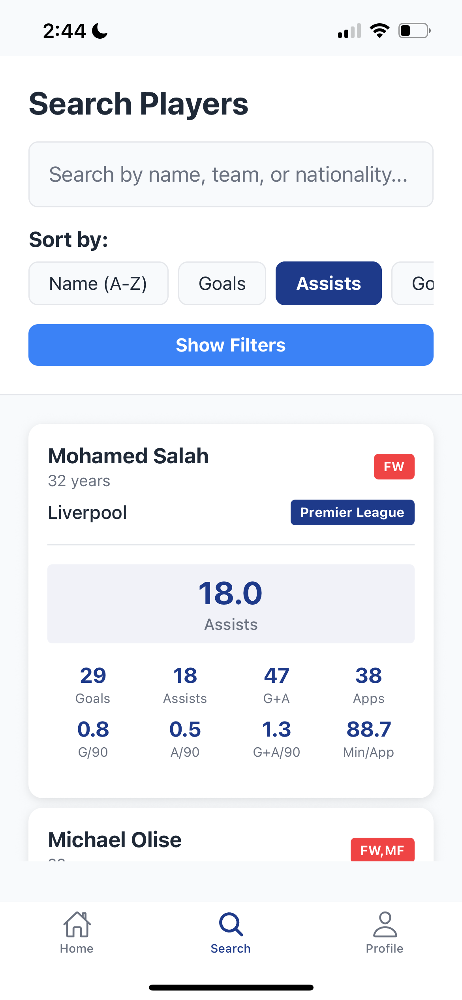
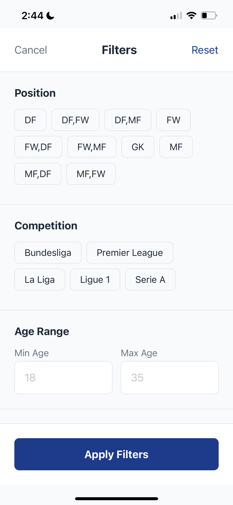

# SoccerLens

Your Ultimate Soccer Player Search & Analytics Platform

## Demo

Watch the SoccerLens mobile app in action through these screenshots:

### App Features Showcase

**Home Screen & Navigation**


**Sorting by Name**


**Sorting by Goals**


**Sorting by Assists**


**Advanced Filters**


**Similar Players Feature**


## Features

### Advanced Player Search
- **Fuzzy Search**: Find players by name, team, or nationality
- **Smart Filtering**: Filter by position, league, age, goals, assists, and more
- **Extensible Sorting**: Sort by 50+ statistics including goals, assists, defensive stats, and calculated metrics
- **Real-time Results**: Instant search with pagination and performance optimization

### Comprehensive Statistics
- **47 Statistical Fields** per player including:
  - **Attacking**: Goals, assists, expected goals (xG), shot accuracy
  - **Defensive**: Tackles, interceptions, blocks, clearances
  - **Possession**: Pass completion, dribbles, progressive actions
  - **Goalkeeper**: Saves, clean sheets, goals against per 90
  - **Calculated Metrics**: Goals per 90, assists per 90, goal contributions

### Dynamic Leaderboards
- **Top Goal Scorers**: Premier League, La Liga, Serie A, Bundesliga, Ligue 1
- **Assist Leaders**: Best playmakers across all leagues
- **Defensive Stats**: Top tacklers, interceptors, and shot blockers
- **Goalkeeper Rankings**: Best save percentages and clean sheet records
- **Extensible System**: Easy to add new leaderboard categories

### Player Similarity Search
- **Hybrid Matching**: Statistical + NLP-based similarity
- **Style Analysis**: Find players with similar playing styles
- **Advanced Algorithms**: Vector similarity with configurable methods

### Mobile-First Design
- **React Native App**: Cross-platform iOS and Android support
- **Modern UI**: Clean, intuitive interface with dark/light themes
- **Offline-Ready**: Robust error handling and network connectivity checks
- **Performance Optimized**: Fast loading and smooth navigation

## Tech Stack

### Backend
- **Framework**: Django 4.2.7 + Django REST Framework 3.14.0
- **Database**: SQLite (development) / PostgreSQL-ready (production)
- **Data Processing**: Pandas for CSV import and data manipulation
- **API Features**: RESTful endpoints with filtering, search, pagination, sorting
- **Architecture**: ViewSets, custom filters, extensible sorting system

### Frontend
- **Framework**: React Native with Expo
- **Navigation**: React Navigation (Stack + Tab navigation)
- **State Management**: React hooks and context
- **UI Components**: Custom components with consistent theming
- **API Integration**: Axios with error handling and retry logic

### Data & Analytics
- **Player Database**: 2,854 players from top European leagues
- **Statistics**: 47 fields per player with real-time calculations
- **Search**: Full-text search with fuzzy matching
- **Similarity**: Vector-based player matching algorithms

## Dataset

This project uses the [Football Players Stats 2024-2025](https://www.kaggle.com/datasets/hubertsidorowicz/football-players-stats-2024-2025) dataset from Kaggle, which provides comprehensive statistics for players across top European leagues including:

- **Premier League** (England)
- **La Liga** (Spain) 
- **Serie A** (Italy)
- **Bundesliga** (Germany)
- **Ligue 1** (France)

The dataset includes 47 statistical fields per player, covering attacking, defensive, possession, and goalkeeper statistics. Data is updated regularly to reflect current season performance.

## Database Schema

### Player Model (47 fields)
```python
# Basic Information
name, position, squad, competition, nationality, age

# Performance Statistics
goals, assists, matches_played, minutes, goals_per_90, assists_per_90

# Advanced Metrics
expected_goals, shot_accuracy, pass_completion_percentage
goal_contribution_per_90, progressive_passes, progressive_carries

# Defensive Stats
tackles, interceptions, blocks, clearances, tackles_won_percentage

# Goalkeeper Stats
goals_against_per_90, save_percentage, clean_sheets, saves

# Calculated Fields
goals_assists, goal_contribution_per_90, dribble_success_percentage
```

## API Endpoints

### Core Endpoints
```
GET /api/players/                    # List all players with filtering & sorting
GET /api/players/{id}/               # Get specific player details
GET /api/players/search/?q=<query>   # Search players
GET /api/players/leaderboard/        # Get player rankings
GET /api/players/{id}/similar/       # Get similar players
GET /api/players/sort_options/       # Get available sorting options
```

### Filter Options
```
GET /api/players/positions/          # Available positions
GET /api/players/competitions/       # Available leagues
GET /api/players/teams/             # Available teams
GET /api/players/nations/           # Available nationalities
```

### Example API Calls
```bash
# Get top goal scorers
curl "http://localhost:8000/api/players/?sort_by=goals&sort_order=desc&page_size=10"

# Search for players
curl "http://localhost:8000/api/players/search/?q=Kane&position=FW"

# Filter by league and position
curl "http://localhost:8000/api/players/?competition=eng+Premier+League&position=FW"

# Get similar players
curl "http://localhost:8000/api/players/1692/similar/?method=hybrid&limit=10"

# Get leaderboard
curl "http://localhost:8000/api/players/leaderboard/?stat=goals&limit=10"
```

## Quick Start

### 1. Backend Setup
```bash
# Clone and enter project
cd SoccerLens

# Create virtual environment
python3 -m venv venv
source venv/bin/activate  # On Windows: venv\Scripts\activate

# Install dependencies
pip install -r requirements.txt

# Run migrations
python manage.py migrate

# Load player data
python manage.py load_players players_data-2024_2025.csv --clear

# Start development server
python manage.py runserver 0.0.0.0:8000
```

### 2. Mobile App Setup
```bash
# Navigate to mobile app directory
cd soccerlens-mobile

# Install dependencies
npm install

# Start Expo development server
npx expo start

# Run on iOS simulator
npx expo run:ios

# Run on Android emulator
npx expo run:android
```

### 3. Test the Application
```bash
# Test API connectivity
curl http://localhost:8000/api/players/?page_size=5

# Check mobile app connectivity
# Ensure your device/emulator can reach localhost:8000
```

## Mobile App Features

### Screens
- **Home**: Top scorers, assist leaders, quick actions
- **Search**: Advanced player search with filters and sorting
- **Leaderboards**: Dynamic rankings by various statistics
- **Player Details**: Comprehensive player profiles and stats
- **Filters**: Position, league, age, and performance filters

### Key Features
- **Real-time Search**: Instant results as you type
- **Smart Sorting**: 50+ sorting options with proper order handling
- **Error Handling**: Graceful network error handling
- **Performance**: Optimized loading and smooth navigation
- **Responsive Design**: Works on all screen sizes

## Configuration

### Backend Settings
```python
# Database (soccerlens_backend/settings.py)
DATABASES = {
    'default': {
        'ENGINE': 'django.db.backends.sqlite3',  # Development
        # 'ENGINE': 'django.db.backends.postgresql',  # Production
        'NAME': BASE_DIR / 'db.sqlite3',
    }
}

# CORS for mobile app
CORS_ALLOWED_ORIGINS = [
    "http://localhost:3000",
    "http://localhost:8081",  # Expo default
]
```

### Mobile App Configuration
```typescript
// API base URL (src/services/api.ts)
const API_BASE_URL = 'http://localhost:8000';  # Development
// const API_BASE_URL = 'https://your-api.com';  # Production
```

## Performance & Optimization

### Backend Optimizations
- **Database Indexes**: Strategic indexing on frequently queried fields
- **Bulk Operations**: Efficient data loading with batch processing
- **Query Optimization**: Optimized ORM queries with select_related
- **Caching**: Redis-ready caching configuration
- **Pagination**: Built-in pagination for large datasets

### Frontend Optimizations
- **Lazy Loading**: Images and data loaded on demand
- **Debounced Search**: Prevents excessive API calls
- **Error Boundaries**: Graceful error handling
- **Memory Management**: Proper cleanup of event listeners
- **Network Optimization**: Request caching and retry logic

## Testing

### Backend Testing
```bash
# Run Django tests
python manage.py test

# Test specific app
python manage.py test players

# Run with coverage
coverage run --source='.' manage.py test
coverage report
```

### Mobile App Testing
```bash
# Run Jest tests
npm test

# Run with coverage
npm test -- --coverage

# E2E testing with Detox (if configured)
npx detox test
```

## Deployment

### Backend Deployment
```bash
# Production settings
python manage.py collectstatic
python manage.py migrate
gunicorn soccerlens_backend.wsgi:application

# Docker deployment
docker build -t soccerlens-backend .
docker run -p 8000:8000 soccerlens-backend
```

### Mobile App Deployment
```bash
# Build for production
npx expo build:ios
npx expo build:android

# Publish to app stores
npx expo publish
```

## Data Sources

- **Player Statistics**: Official league data from top European competitions
- **Data Coverage**: Premier League, La Liga, Serie A, Bundesliga, Ligue 1
- **Update Frequency**: Seasonal updates with comprehensive statistics
- **Data Quality**: Validated and cleaned data with error handling
- **Dataset Source**: [Football Players Stats 2024-2025](https://www.kaggle.com/datasets/hubertsidorowicz/football-players-stats-2024-2025) on Kaggle

## Contributing

1. Fork the repository
2. Create a feature branch (`git checkout -b feature/amazing-feature`)
3. Commit your changes (`git commit -m 'Add amazing feature'`)
4. Push to the branch (`git push origin feature/amazing-feature`)
5. Open a Pull Request

## License

This project is licensed under the MIT License - see the LICENSE file for details.

## Support

- **Documentation**: Check the code comments and API documentation
- **Issues**: Report bugs and feature requests via GitHub Issues
- **Discussions**: Join the community discussions for help and ideas

---

**SoccerLens** - Your Ultimate Soccer Player Search & Analytics Platform 
